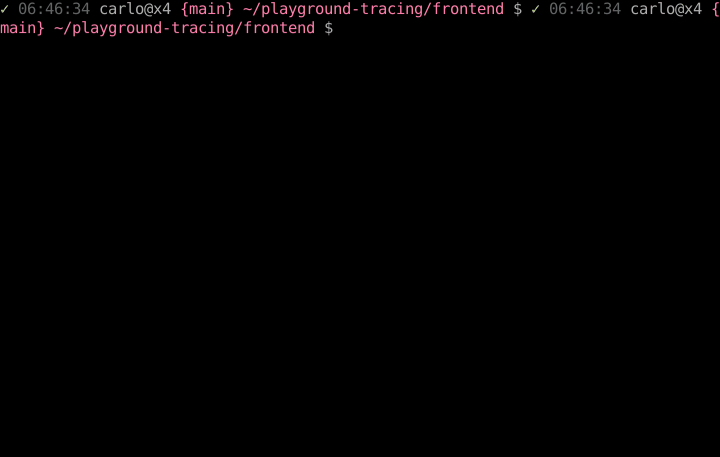
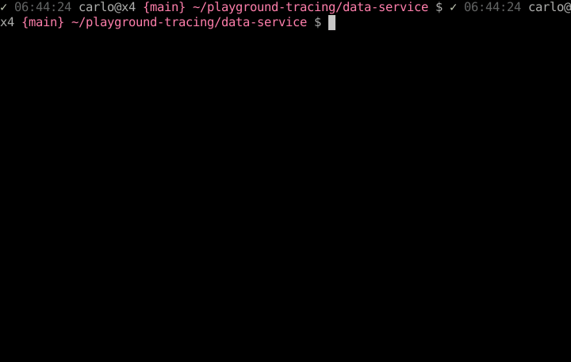

# playground-tracing

(Docker Compose)[https://docs.docker.com/compose] for (ElasticSearch)[https://www.elastic.co], (Redis)[https://redis.io], (Zipkin)[https://zipkin.io]:

Haskell front-end with Redis for message queue:

Python/Flask back end, querying Google Cloud hosted Postgresql:

Haskell components use (tracing-0.0.7.3)[https://hackage.haskell.org/package/tracing-0.0.7.3/docs/Monitor-Tracing-Zipkin.html]

Python component uses (OpenTelemetry)[https://opentelemetry.io/docs/instrumentation/python/], (sqlcommenter)[https://google.github.io/sqlcommenter/], (cloud-sql-python-connector)[https://pypi.org/project/cloud-sql-python-connector/].
